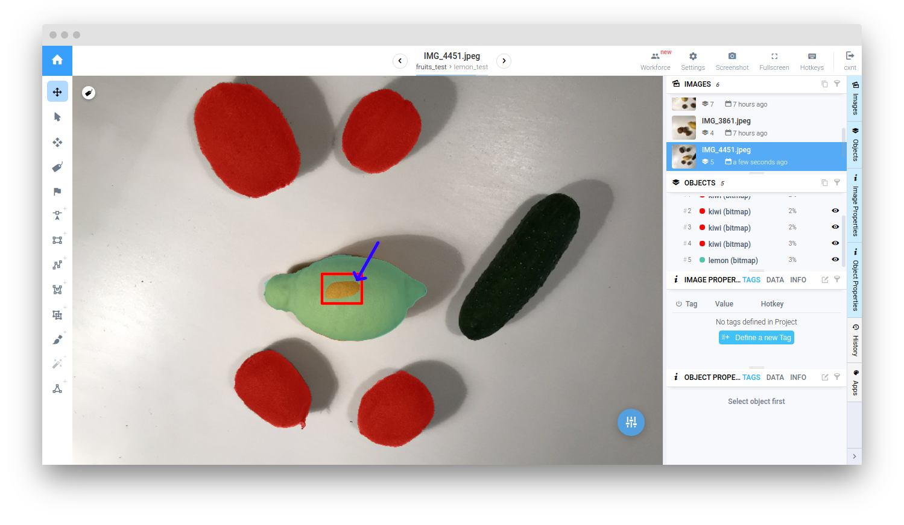

# From Supervisely to Cityscapes format

  <a href="#Overview">Overview</a> •
  <a href="#Preparation">Preparation</a> •
  <a href="#How-To-Run">How To Run</a> •
  <a href="#How-To-Use">How To Use</a>

## Overview

Converts [Supervisely](https://docs.supervise.ly/data-organization/00_ann_format_navi) project to [Cityscapes](https://github.com/mcordts/cityscapesScripts) format and prepares downloadable `tar` archive.

Supervisely project have to contain only classes with shapes `Polygon` or `Bitmap`. It means that all labeled objects have to be polygons or bitmaps. If your project has classes with other shapes and you would like to convert the shapes of these classes and all corresponding objects (e.g. rectangles to polygons), we recommend to use [`Convert Class Shape`](https://ecosystem.supervise.ly/apps/convert-class-shape) app. 

## Important notes

1) **Labeled foreground objects must never have holes([Cityscapes format doesn't support them](https://www.cityscapes-dataset.com/dataset-overview/#labeling-policy))**, i.e. if there is some background visible through a foreground object, it is considered to a be part of the foreground. If objects in Supervisely format have holes, after export to Cityscapes format holes will be filled with class color, so you may lose some of the input data.

2) If `Bitmap` in Supervisely format contain **unconnected components**, this figure will be splitted into separate objects after export to Cityscapes format.

3) Unlike the standard Cityscapes format, which can contain well-defined classes with well-defined colors and ids, project derived from Supervisely format can contain classes with **any names and colors**. 
In this regard:

- After export Supervisely project to Cityscapes format a file in `JSON` format will be added to the root of the resulting project with name `class_to_id.json`. It contains information about Supervisely project classes names, colors and their corresponding ids. 
- Additional annotation file for each image with extension `<image_name>_instanceIds.png` will not be created after conversion(information about classes colors and ids is contained in `class_to_id.json` file)

**Cityscapes dataset structure**

The folder structure of the Cityscapes dataset is as follows:

`{root}/{type}{video}/{split}/{city}/{city}_{seq:0>6}_{frame:0>6}_{type}{ext}`

The meaning of the individual elements is:

- `root` the root folder of the Cityscapes dataset.

- `type` the type/modality of data, e.g. gtFine for fine ground truth, or leftImg8bit for left 8-bit images.

- `split` the split, i.e. `train/val/test`. Note: not all kinds of data exist for all splits. Thus, do not be surprised to occasionally find empty folders.

- `city` location(city) where part of the dataset was recorded. In Supervisely project `city` is used as a dataset name.

You can download example of Cityscapes datasets [here](https://www.cityscapes-dataset.com/).

Current version of application supports only:
`gtFine` - the fine annotations. This type of annotations is used for validation, testing, and optionally for training. Annotations are encoded using json files containing the individual polygons.
`leftImg8bit` - the images. These are the standard annotated images.

In addition, Cityscapes format implies the presence of train/val datasets, and also train/val/test. Thus, to split images on training and validation datasets you should assign  corresponding tags (`train`, `val`, `test`) to images. If project contains one of `train`, `val`, `test` tags, resulting archive also will contain it. If image doesn't have such tags, tags `train`, `val` and `test` will be assigned automatically in proportions `train(60%)`, `val(20%)`, `test(20%)`.

## How To Run 
**Step 1**: Add app to your team from [Ecosystem](https://ecosystem.supervise.ly/apps/convert-supervisely-to-cityscapes-format) if it is not there.

**Step 2**: Open context menu of project -> `Download as` -> `Export to Cityscapes format` 

## How to use
After running the application, you will be redirected to the Tasks page. Once application processing has finished, your link for downloading will become available. Click on the file name to download it.

**Note** You can also find your converted project in: Team Files->cityscapes_format->app_id->`projectId_projectName_formatName.tar.gz`

